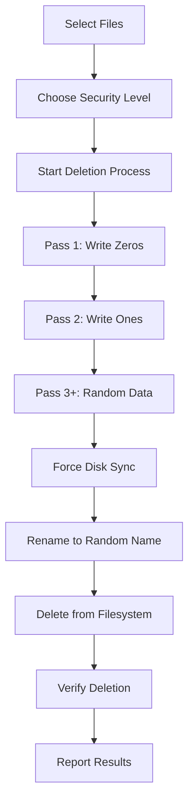

# 🔒 ProWipe - Advanced Secure File Deletion Tool

[](https://www.python.org/downloads/)
[](LICENSE)
[](https://www.microsoft.com/windows)
[](https://github.com/TomSchimansky/CustomTkinter)


> **ProWipe** is a professional-grade secure file deletion tool that permanently removes files beyond recovery using military-standard overwrite algorithms. Unlike standard deletion methods, ProWipe ensures your sensitive data cannot be recovered even with advanced forensic tools.

## 🌟 Features

### 🛡️ **Military-Grade Security**
- **DoD 5220.22-M Standard**: 3-pass overwrite (zeros, ones, random data)
- **Gutmann Method**: 35-pass overwrite for maximum security
- **Custom Pass Options**: 1, 3, 7, or 35 overwrite passes
- **Disk Sync Enforcement**: Forces data to be written to physical storage

### 🎨 **Modern User Interface**
- **Dark Theme**: Professional customtkinter interface
- **Drag & Drop**: Intuitive file selection
- **Real-time Progress**: Visual progress tracking with detailed status
- **Batch Processing**: Handle multiple files and entire folders
- **Error Reporting**: Comprehensive deletion status and error handling

### ⚙️ **Advanced Options**
- **Verification Mode**: Confirms complete file removal
- **Random Renaming**: Files are renamed before deletion
- **Thread-safe Processing**: Non-blocking UI during operations
- **Multiple Selection Methods**: Choose individual files or entire directories

## 📋 Table of Contents

- [Installation](#-installation)
- [Usage](#-usage)
- [Security Levels](#-security-levels)
- [How It Works](#-how-it-works)
- [Screenshots](#-screenshots)
- [Requirements](#-requirements)
- [Contributing](#-contributing)
- [License](#-license)
- [Disclaimer](#-disclaimer)

## 🚀 Installation

### Prerequisites
- Python 3.7 or higher
- Windows Operating System

### Install Dependencies
```bash
pip install customtkinter
```

### Clone Repository
```bash
git clone https://github.com/LMLK-seal/prowipe.git
cd prowipe
```

### Run ProWipe
```bash
python prowipe.py
```

## 💻 Usage

### Basic Usage
1. **Launch ProWipe**: Run the application
2. **Select Files**: Use "Select Files" or "Select Folder" buttons
3. **Choose Security Level**: Select overwrite passes (1-35)
4. **Configure Options**: Enable verification if desired
5. **Secure Delete**: Click the red deletion button and confirm

### Command Line Options
ProWipe currently operates through GUI only. CLI version coming soon.

## 🔐 Security Levels

| Passes | Method | Security Level | Use Case |
|--------|--------|----------------|----------|
| **1** | Single random overwrite | ⭐ Basic | Quick deletion, non-sensitive files |
| **3** | DoD 5220.22-M Standard | ⭐⭐⭐ Recommended | Standard secure deletion |
| **7** | Enhanced multi-pass | ⭐⭐⭐⭐ High | Sensitive business data |
| **35** | Gutmann Method | ⭐⭐⭐⭐⭐ Maximum | Classified/highly sensitive data |

## 🔬 How It Works

### Secure Deletion Process



### Technical Implementation

1. **File Overwriting**: Multiple passes with different data patterns
   - **Pass 1**: All zeros (`0x00`)
   - **Pass 2**: All ones (`0xFF`) 
   - **Pass 3+**: Cryptographically secure random data

2. **Disk Synchronization**: Uses `os.fsync()` to force data to physical storage

3. **Filename Obfuscation**: Renames files to random hexadecimal strings

4. **Verification**: Optional post-deletion verification ensures complete removal

## 📸 Screenshots

### Main Interface


### File Selection


### Deletion Progress


## 🛠️ Requirements

### System Requirements
- **OS**: Windows 7/8/10/11
- **Python**: 3.7+
- **RAM**: 100MB minimum
- **Storage**: 50MB for installation

### Python Dependencies
```txt
customtkinter>=5.0.0
```

## 🔒 Security Considerations

### ⚠️ Important Notes
- **Irreversible**: ProWipe deletion is **PERMANENT** and cannot be undone
- **SSD Limitations**: Modern SSDs with wear leveling may retain data traces
- **Backup Recommendation**: Always backup important files before deletion
- **Testing**: Test with non-critical files first

### 🛡️ Protection Against
- ✅ Standard file recovery tools
- ✅ Disk scanning utilities  
- ✅ Basic forensic analysis
- ✅ Undelete software
- ⚠️ Advanced forensic techniques (partial protection)
- ❌ Hardware-level microscopy (requires physical destruction)

## 🤝 Contributing

We welcome contributions! Please see our [Contributing Guidelines](CONTRIBUTING.md).

### Development Setup
```bash
git clone https://github.com/yourusername/prowipe.git
cd prowipe
pip install -r requirements-dev.txt
```

### Reporting Issues
- 🐛 [Bug Reports](https://github.com/yourusername/prowipe/issues/new?template=bug_report.md)
- 💡 [Feature Requests](https://github.com/yourusername/prowipe/issues/new?template=feature_request.md)

## 📊 Project Stats


## 📄 License

This project is licensed under the MIT License - see the [LICENSE](LICENSE) file for details.

## ⚖️ Disclaimer

**IMPORTANT LEGAL NOTICE**: 

ProWipe is designed for legitimate data sanitization purposes only. Users are solely responsible for:

- ✅ Ensuring they have proper authorization to delete files
- ✅ Complying with local laws and regulations
- ✅ Understanding that deletion is permanent and irreversible
- ✅ Backing up important data before use

The developers assume **NO LIABILITY** for data loss, misuse, or any damages resulting from the use of this software.

## 🙏 Acknowledgments

- CustomTkinter team for the modern GUI framework
- Security research community for deletion algorithms
- Beta testers and contributors

---

<div align="center">

**⭐ Star this repository if ProWipe helped you secure your data! ⭐**

</div>
